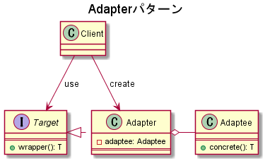
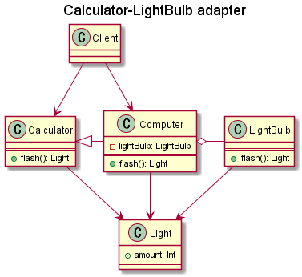

# Adapterパターン

## 概要

ある機能が持つ役割を変えることなく、他の機能を利用するための手法。  
双方に互換性が無い機能を適合させることからAdapterと呼ばれる。

## クラス図

AdapterとAdapteeの関係は`is a`関係と`has a`関係のどちらでも可能。  

## 実装例

複数個所から利用されており、大幅な修正が困難な`Calculator`クラスがあるとする。また、Calculatorとは互換性を持たず、電球を点灯する機能をもつ`LightBulb`クラスがあるとする。  
このとき、Calculatorクラスに「電球を点灯する」機能を付与したい。
Calculatorクラスを直接修正する代替策として、Calculatorクラスの機能を継承した`Computer`クラスを作成する。

## 実装したクラス図

## 参考資料

[Java言語で学ぶデザインパターン入門](https://www.amazon.co.jp/%E5%A2%97%E8%A3%9C%E6%94%B9%E8%A8%82%E7%89%88Java%E8%A8%80%E8%AA%9E%E3%81%A7%E5%AD%A6%E3%81%B6%E3%83%87%E3%82%B6%E3%82%A4%E3%83%B3%E3%83%91%E3%82%BF%E3%83%BC%E3%83%B3%E5%85%A5%E9%96%80-%E7%B5%90%E5%9F%8E-%E6%B5%A9/dp/4797327030/ref=sr_1_1?ie=UTF8&qid=1448935369&sr=8-1&keywords=java%E8%A8%80%E8%AA%9E%E3%81%A7%E5%AD%A6%E3%81%B6%E3%83%87%E3%82%B6%E3%82%A4%E3%83%B3%E3%83%91%E3%82%BF%E3%83%BC%E3%83%B3)  
[IT専科](http://www.itsenka.com/contents/development/designpattern/adapter.html)  
[GeeksforGeeks](https://www.gkkeeksforgeeks.org/adapter-pattern/)  
[【デザインパターン】 Adapterパターン](https://qiita.com/sugihara-masaki/items/bb56b6e5613ef6d749ff)  
[Think IT](https://thinkit.co.jp/article/936/1)
