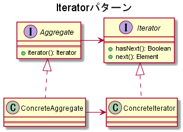
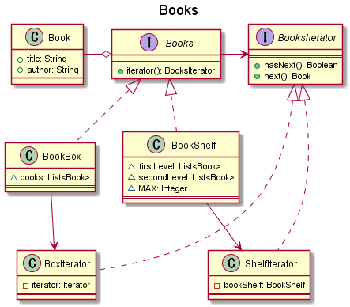

# Iteratorパターン

## 概要

特定の要素を持つ複数のコレクションに対し、それぞれの連続した要素にアクセスしたいとする。  
コレクションの実装が異なる場合、要素にアクセスする方法もそれに応じて変え無ければならない。  
この時、要素へのアクセスに関する実装を隠蔽し、コレクションごとの差異を埋めるための手法。  

## クラス図

## 実装例

本の情報を保持する`Book`クラスと、複数の本を保持する`Books`インターフェースを実装した`BookBox`クラスと`BookShelf`クラスがある。
BookBoxクラスはコレクションを一つしか持たないが、BookShelfは一段目と二段目で異なるコレクションとして実装している。  
この時、Booksの保持した書籍の情報を実装に寄らず同じ方法で取得したい。  

## 実装したクラス図

## 参考資料

[Java言語で学ぶデザインパターン入門](https://www.amazon.co.jp/%E5%A2%97%E8%A3%9C%E6%94%B9%E8%A8%82%E7%89%88Java%E8%A8%80%E8%AA%9E%E3%81%A7%E5%AD%A6%E3%81%B6%E3%83%87%E3%82%B6%E3%82%A4%E3%83%B3%E3%83%91%E3%82%BF%E3%83%BC%E3%83%B3%E5%85%A5%E9%96%80-%E7%B5%90%E5%9F%8E-%E6%B5%A9/dp/4797327030/ref=sr_1_1?ie=UTF8&qid=1448935369&sr=8-1&keywords=java%E8%A8%80%E8%AA%9E%E3%81%A7%E5%AD%A6%E3%81%B6%E3%83%87%E3%82%B6%E3%82%A4%E3%83%B3%E3%83%91%E3%82%BF%E3%83%BC%E3%83%B3)  
[GeeksforGeeks](https://www.geeksforgeeks.org/iterator-pattern/)  
[【デザインパターン】 Iteratorパターン](https://qiita.com/sugihara-masaki/items/0d3982276eb7494dc25d)  
[TECHSCORE](https://www.techscore.com/tech/DesignPattern/Iterator/Iterator1.html/)  
