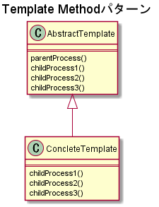
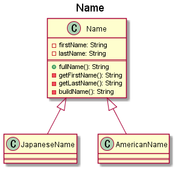

# Template Methodパターン

## 概要

処理の順序が同じものを抽象化してまとめる手法。

## クラス図

## 実装例

名前を管理する`Name`クラスがあり、フルネームを出力する`fullName`メソッドを持つとする。
このとき、日本人は姓→名の順に出力し、アメリカ人は名→姓の順に出力したいとする。

## 実装したクラス図

## 参考資料

[Java言語で学ぶデザインパターン入門](https://www.amazon.co.jp/%E5%A2%97%E8%A3%9C%E6%94%B9%E8%A8%82%E7%89%88Java%E8%A8%80%E8%AA%9E%E3%81%A7%E5%AD%A6%E3%81%B6%E3%83%87%E3%82%B6%E3%82%A4%E3%83%B3%E3%83%91%E3%82%BF%E3%83%BC%E3%83%B3%E5%85%A5%E9%96%80-%E7%B5%90%E5%9F%8E-%E6%B5%A9/dp/4797327030/ref=sr_1_1?ie=UTF8&qid=1448935369&sr=8-1&keywords=java%E8%A8%80%E8%AA%9E%E3%81%A7%E5%AD%A6%E3%81%B6%E3%83%87%E3%82%B6%E3%82%A4%E3%83%B3%E3%83%91%E3%82%BF%E3%83%BC%E3%83%B3)  
[サルでもわかる 逆引きデザインパターン](http://www.nulab.co.jp/designPatterns/designPatterns3/designPatterns3-1.html)
